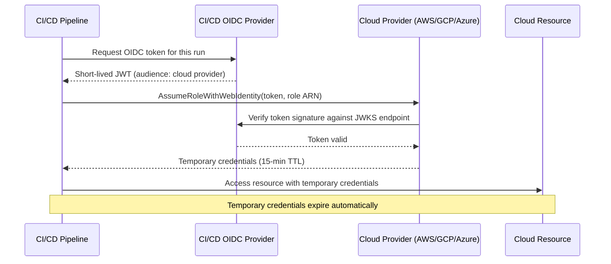
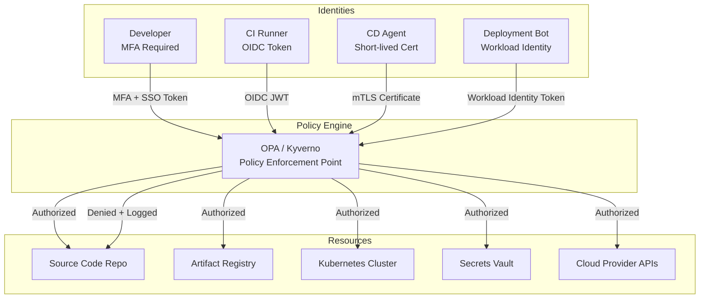

# Secure CI/CD Reference Architecture

## Table of Contents

- [Secure Pipeline Architecture Overview](#secure-pipeline-architecture-overview)
- [Secure Build Environment Design](#secure-build-environment-design)
- [Artifact Repository Security](#artifact-repository-security)
- [Pipeline Identity and Access Management](#pipeline-identity-and-access-management)
- [Network Segmentation for Pipeline Components](#network-segmentation-for-pipeline-components)
- [Zero-Trust CI/CD Architecture](#zero-trust-cicd-architecture)
- [Multi-Zone Pipeline Design](#multi-zone-pipeline-design)
- [Environment Segregation](#environment-segregation)

---

## Secure Pipeline Architecture Overview

The Secure CI/CD Reference Architecture defines a layered security model for software delivery pipelines built on the principle of defense in depth. Each layer applies independent security controls so that a failure in any single layer does not result in a security compromise.

The architecture is designed around five security zones:

1. **Developer Zone** — The developer's local environment, including IDE, local build tools, and pre-commit hooks
2. **Source Control Zone** — The version control system and its associated security controls
3. **CI Build Zone** — The automated build and security scanning environment
4. **Staging Zone** — Pre-production environments for integration testing, DAST, and compliance validation
5. **Production Zone** — The live production environment with runtime security controls

Each zone boundary represents a security checkpoint where artifacts, code, and configuration are verified before crossing into the next zone.

### Secure Pipeline Architecture (Mermaid)

```mermaid
graph TB
    subgraph DEV[Developer Zone]
        A[Developer Workstation] --> B[IDE Security Plugin]
        B --> C[Pre-commit Hooks\nSecret Detection\nLinting]
    end

    subgraph SCM[Source Control Zone]
        D[Pull Request] --> E[Branch Protection\nRequired Reviews\nStatus Checks]
        E --> F[Automated PR Scans\nSAST / SCA / Secrets]
        F --> G[Merge to Main]
    end

    subgraph CI[CI Build Zone - Ephemeral]
        H[Build Trigger] --> I[Ephemeral Runner Provisioned]
        I --> J[Dependency Installation\nSCA Scan]
        J --> K[Code Compilation\nSAST Scan]
        K --> L[Container Build\nImage Scan]
        L --> M[IaC Scan\nPolicy Validation]
        M --> N[SBOM Generation\nArtifact Signing]
        N --> O[Runner Destroyed]
    end

    subgraph STAGING[Staging Zone]
        P[Artifact Pull + Verify Signature] --> Q[Deploy to Staging]
        Q --> R[DAST Scan]
        R --> S[Compliance Validation]
        S --> T[Approval Gate]
    end

    subgraph PROD[Production Zone]
        U[Admission Control\nSignature Verification] --> V[Progressive Deploy\nCanary / Blue-Green]
        V --> W[Runtime Security\nFalco / CSPM]
        W --> X[SIEM Monitoring]
    end

    C --> D
    G --> H
    O --> P
    T --> U
```



---

## Secure Build Environment Design

### Ephemeral Build Environments

The cornerstone of a secure build architecture is the use of ephemeral runners — build environments that are created fresh for each pipeline run and completely destroyed after completion. Ephemeral environments provide:

- **No state persistence** — attacker-injected code, malware, or backdoors cannot persist between pipeline runs
- **Clean dependency installation** — each build starts from a known-good baseline, preventing build environment drift
- **Reduced attack surface** — environments only exist during the execution window, limiting the window of exploitation
- **Auditability** — each build environment is defined entirely by its configuration, enabling reproducibility

**Implementation approach:**

```yaml
# GitHub Actions: Force ephemeral runners
jobs:
  build:
    runs-on: ubuntu-latest  # Cloud-hosted ephemeral runner
    # OR for self-hosted:
    runs-on: [self-hosted, ephemeral, linux]
    # Self-hosted ephemeral runners: configure runner scale set
    # with --ephemeral flag; runner de-registers after one job
```

For self-hosted infrastructure, ephemeral runners are implemented using:
- **GitHub Actions Runner Scale Sets** with `--ephemeral` flag
- **GitLab Runner with Docker executor** in `--non-interactive` mode
- **Jenkins ephemeral agents** provisioned via Kubernetes Plugin
- **Kubernetes Jobs** provisioned on demand and cleaned up after completion

### Build Environment Hardening

Build environments, whether ephemeral or not, must be hardened to reduce the blast radius of a compromise:

| Control | Description | Implementation |
|---|---|---|
| Rootless containers | Run build processes as non-root user | `USER nonroot` in Dockerfile; `securityContext.runAsNonRoot: true` in Kubernetes |
| Read-only filesystem | Prevent modification of the base OS during builds | `readOnlyRootFilesystem: true`; tmpfs mounts for writable directories |
| No privilege escalation | Prevent processes from gaining elevated privileges | `allowPrivilegeEscalation: false` |
| Capability dropping | Remove Linux capabilities not required for building | `capabilities.drop: ["ALL"]`; add only required capabilities |
| Network egress controls | Restrict outbound traffic to known-good destinations | Egress network policies; allowlisted domains for package registries |
| Resource limits | Prevent resource exhaustion attacks | CPU and memory limits on all build containers |
| Immutable base image | Build from a pinned, verified base image | Pin base images to digest: `FROM ubuntu@sha256:<digest>` |

### Build Reproducibility

Reproducible builds ensure that building the same source code with the same inputs always produces the same output. This is a key security property because:

- It enables independent verification of build outputs
- It prevents the "my machine works" class of supply chain attacks
- It makes build tampering detectable

Achieving reproducible builds requires:
- Pinning all build tool versions
- Pinning all dependency versions (lock files)
- Eliminating non-deterministic inputs (timestamps, random seeds in build metadata)
- Standardizing the build environment configuration

### Secrets in the Build Environment

Secrets required by the build process must never be stored in:
- Environment variables that are logged (any env var that a build tool might dump)
- Container image layers
- Build artifact metadata
- Source code or build configuration files

**Secure secrets injection pattern:**

```yaml
# GitHub Actions: Secrets injected as masked environment variables
jobs:
  build:
    steps:
      - name: Build application
        env:
          # Secrets injected from GitHub Secrets, never hard-coded
          NPM_TOKEN: ${{ secrets.NPM_TOKEN }}
          ARTIFACTORY_TOKEN: ${{ secrets.ARTIFACTORY_TOKEN }}
        run: npm install && npm run build

      # For cloud credentials: Use OIDC, not stored secrets
      - name: Configure AWS credentials
        uses: aws-actions/configure-aws-credentials@v4
        with:
          role-to-assume: arn:aws:iam::123456789:role/GitHubActionsDeployRole
          aws-region: us-east-1
          # OIDC token used to assume role; no AWS credentials stored
```

---

## Artifact Repository Security

### Repository Structure

Artifact repositories must be organized to reflect deployment environment boundaries and apply appropriate access controls per environment.

```
artifact-registry/
├── dev/            # Dev builds; broad read access; frequent writes
│   ├── images/
│   └── packages/
├── staging/        # Staging builds; restricted write; read for staging deploy
│   ├── images/
│   └── packages/
└── production/     # Production releases only; very restricted write; signed only
    ├── images/
    └── packages/
```

### Access Control for Artifact Repositories

| Role | dev | staging | production |
|---|---|---|---|
| Developer | Read/Write | Read | No access |
| CI Pipeline (dev) | Read/Write | No access | No access |
| CI Pipeline (staging) | Read | Read/Write | No access |
| CD Pipeline (production) | No access | Read | Read |
| Release Engineer | Read | Read/Write | Write (with approval) |
| Security Team | Read | Read | Read |

### Immutable Artifact Tags

In production artifact repositories:
- Tags must be immutable — once a tag (e.g., `v1.2.3`) is published, it cannot be overwritten
- Deletions require explicit approval and are audit-logged
- Only signed artifacts are accepted into production repositories

**JFrog Artifactory configuration:**
```json
{
  "key": "production-docker",
  "rclass": "local",
  "dockerApiVersion": "V2",
  "xrayIndex": true,
  "propertySets": ["security-metadata"],
  "handleReleases": true,
  "handleSnapshots": false,
  "blockXrayUnscannedArtifacts": true,
  "blockUnscannedArtifacts": true
}
```

### Artifact Signing and Verification

All production artifacts must be cryptographically signed before promotion. The signing process:

1. **Build artifact** — CI pipeline builds and tests the artifact
2. **Sign with Cosign/Sigstore** — artifact digest signed with pipeline's OIDC identity (keyless signing)
3. **Transparency log entry** — signature recorded in Rekor transparency log
4. **Policy enforcement** — admission controller verifies signature before deployment

```bash
# Sign a container image using keyless Cosign (OIDC identity)
# Run inside GitHub Actions / GitLab CI where OIDC token is available
cosign sign --yes \
  --rekor-url=https://rekor.sigstore.dev \
  ghcr.io/myorg/myapp@sha256:<digest>

# Verify a signature before deployment
cosign verify \
  --certificate-identity-regexp="https://github.com/myorg/myrepo/.github/workflows/.*" \
  --certificate-oidc-issuer="https://token.actions.githubusercontent.com" \
  ghcr.io/myorg/myapp@sha256:<digest>
```

---

## Pipeline Identity and Access Management

### The Problem with Long-Lived Credentials

Traditional CI/CD pipelines authenticate to cloud providers, artifact registries, and external services using long-lived credentials (API keys, service account JSON files, username/password). These credentials create significant security risk:

- Long exposure window — a leaked credential is valid until manually rotated
- Credential sprawl — multiple pipelines each holding their own copies of credentials
- Rotation difficulty — changing credentials requires coordinated updates across all pipelines
- Over-permissioned by default — developers tend to grant broad permissions to avoid access errors

### OIDC Federation: The Modern Approach

OIDC (OpenID Connect) federation allows CI/CD platforms to issue short-lived, pipeline-run-specific tokens that cloud providers trust natively. No long-lived credentials are stored in the CI/CD system.

**OIDC federation flow:**



**GitHub Actions OIDC with AWS:**
```yaml
permissions:
  id-token: write   # Required for OIDC
  contents: read

jobs:
  deploy:
    runs-on: ubuntu-latest
    steps:
      - uses: aws-actions/configure-aws-credentials@v4
        with:
          role-to-assume: ${{ vars.AWS_DEPLOY_ROLE_ARN }}
          aws-region: us-east-1
          # Trust policy on the IAM role restricts to specific repo/branch:
          # "StringLike": {
          #   "token.actions.githubusercontent.com:sub":
          #     "repo:myorg/myrepo:ref:refs/heads/main"
          # }
```

### Least-Privilege Pipeline Token Design

Each pipeline job should receive only the permissions it needs for that specific task:

| Pipeline Job | Required Permissions | Explicitly Denied |
|---|---|---|
| Build and test | Read source code, write build logs | No cloud access, no registry write |
| Push to dev registry | Write to dev image repository | No staging/prod access |
| Deploy to staging | Read staging artifacts, write staging k8s namespace | No prod namespace access |
| Deploy to production | Read prod artifacts, write prod k8s namespace (with approval) | No secrets write, no IAM changes |

### Service Account Hardening

For pipelines that cannot use OIDC federation, service account credentials must be hardened:

- **Minimum TTL** — credentials expire within 24 hours and are automatically rotated
- **Scope restriction** — credentials scoped to specific repositories, services, or resources
- **Audit logging** — all credential usage logged and anomaly-monitored
- **Rotation automation** — Vault dynamic secrets or cloud provider rotation used where possible
- **Emergency revocation** — process documented and tested for immediate credential revocation

---

## Network Segmentation for Pipeline Components

### Pipeline Network Zones

CI/CD infrastructure should be segmented into distinct network zones with controlled inter-zone traffic:

```
+-------------------------------+    +-------------------------------+
|       CI BUILD NETWORK        |    |    ARTIFACT NETWORK           |
|                               |    |                               |
|  Runner Subnet: 10.10.1.0/24  |    |  Registry Subnet: 10.10.2.0/24|
|  - Outbound to package repos  |    |  - Inbound from CI Build      |
|  - Inbound from SCM triggers  |    |  - Inbound from CD Deploy     |
|  - NO direct access to prod   |    |  - No direct internet access  |
|                               |    |                               |
+-------------------------------+    +-------------------------------+
              |                                    |
              v                                    v
+-------------------------------+    +-------------------------------+
|     STAGING ENVIRONMENT       |    |   PRODUCTION ENVIRONMENT      |
|                               |    |                               |
|  App Subnet: 10.20.0.0/16     |    |  App Subnet: 10.30.0.0/16     |
|  - Accessible from CI (DAST)  |    |  - Accessible from CD only    |
|  - NOT accessible from internet|   |  - Strict egress controls     |
|                               |    |  - WAF on ingress             |
+-------------------------------+    +-------------------------------+
```

### Egress Control for Build Environments

Build environments must have controlled outbound network access to:
- Prevent exfiltration of secrets through DNS, HTTP, or other protocols
- Limit the ability of compromised builds to communicate with C2 infrastructure
- Enforce use of internal package mirrors rather than public registries

**Kubernetes NetworkPolicy for CI builds:**
```yaml
apiVersion: networking.k8s.io/v1
kind: NetworkPolicy
metadata:
  name: ci-build-egress-policy
  namespace: ci-builds
spec:
  podSelector:
    matchLabels:
      role: ci-runner
  policyTypes:
    - Egress
  egress:
    # Allow DNS
    - ports:
        - port: 53
          protocol: UDP
    # Allow access to internal package mirror
    - to:
        - namespaceSelector:
            matchLabels:
              name: package-mirrors
      ports:
        - port: 443
    # Allow access to artifact registry
    - to:
        - namespaceSelector:
            matchLabels:
              name: artifact-registry
      ports:
        - port: 443
    # Block all other egress explicitly by absence of rule
```

---

## Zero-Trust CI/CD Architecture

### Zero-Trust Principles Applied to CI/CD

Traditional CI/CD security assumed that components within the pipeline network trusted each other implicitly. Zero-trust CI/CD applies the "never trust, always verify" principle to every pipeline interaction:

1. **Every pipeline identity is authenticated** — no implicit trust based on network location; every component authenticates explicitly
2. **Every action is authorized** — RBAC and ABAC policies define what each identity can do; no wildcard permissions
3. **Every access is logged** — all authentication and authorization decisions are recorded in immutable audit logs
4. **Least-privilege by default** — minimum necessary permissions granted; all access requires explicit justification
5. **Continuous verification** — permissions re-validated for each request; no session-based implicit authorization

### Zero-Trust Identity Architecture



---

## Multi-Zone Pipeline Design

A multi-zone pipeline architecture separates pipeline stages across security zones with controlled promotion gates between them.

### Zone Definitions

| Zone | Purpose | Security Level | Access Control |
|---|---|---|---|
| Development Zone | Developer iteration, branch builds | Low trust | Developer self-service |
| Integration Zone | Main branch builds, full security scans | Medium trust | Automated promotion; no manual override without approval |
| Staging Zone | Pre-production validation, DAST, load testing | High trust | Automated promotion from Integration; security gate required |
| Production Zone | Live system | Highest trust | Manual approval required; change management integrated |

### Promotion Gates Between Zones

```
Development Zone
      |
      | [Gate: Branch Policy]
      | - Peer review approved
      | - Status checks pass
      v
Integration Zone
      |
      | [Gate: Full Security Scan]
      | - SAST: No new Critical
      | - SCA: No new Critical/High CVEs
      | - Secrets: Clean
      | - IaC: Policy compliant
      | - Container: Signed + no Critical
      v
Staging Zone
      |
      | [Gate: Functional + Security Validation]
      | - DAST: No Critical/High
      | - Integration tests: 100% pass
      | - Performance: Within thresholds
      | - Compliance: All controls verified
      v
Production Zone
```

---

## Environment Segregation

### Segregation Requirements

Environments must be segregated to prevent:
- Unauthorized data flow from production to lower environments
- Credential sharing that could allow a development compromise to reach production
- Configuration drift that masks production-specific security issues

### Environment Segregation Matrix

| Dimension | Development | Staging | Production |
|---|---|---|---|
| Cloud account / subscription | Dedicated dev account | Dedicated staging account | Dedicated production account |
| Kubernetes namespace | `dev-*` namespaces | `staging` namespace | `production` namespace |
| IAM credentials | Dev-scoped only | Staging-scoped only | Production-scoped; MFA required |
| Secrets vault | Dev vault path | Staging vault path | Production vault; strict access |
| Database | Dev database (synthetic data only) | Staging database (anonymized data) | Production database |
| Network | Dev VPC / VNet | Staging VPC / VNet | Production VPC / VNet |
| Monitoring | Dev alerting (low urgency) | Staging alerting (medium urgency) | Production alerting (PagerDuty / OpsGenie) |
| Log retention | 7 days | 30 days | 365 days (compliance) |

### Data Classification Controls

Production data must never flow to development or staging environments:
- Data masking / anonymization pipelines for all data copied to lower environments
- Automated detection of production data in non-production environments
- Contractual and policy controls on developer access to production data
- Separate encryption keys per environment; production keys inaccessible to developers

### Terraform Workspace / Account Separation

```hcl
# terraform/environments/production/provider.tf
provider "aws" {
  region = "us-east-1"
  # Production account: separate AWS account from dev/staging
  assume_role {
    role_arn = "arn:aws:iam::PROD-ACCOUNT-ID:role/TerraformDeployRole"
    # This role is only assumable by the production CD pipeline OIDC identity
    # Developers cannot assume this role directly
  }
}

# Separate state backends per environment prevent state cross-contamination
terraform {
  backend "s3" {
    bucket         = "myorg-terraform-state-production"
    key            = "production/terraform.tfstate"
    region         = "us-east-1"
    encrypt        = true
    dynamodb_table = "terraform-state-lock-production"
    # This bucket is inaccessible from dev/staging pipelines
  }
}
```
